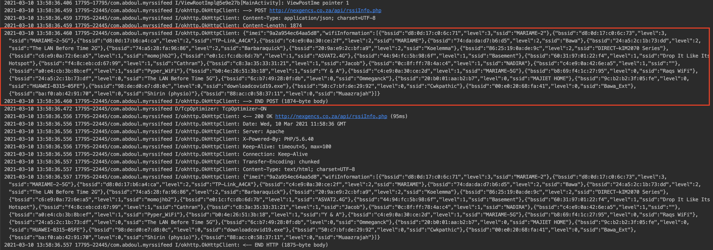

# MyRssiFeed
A simple android application to send rssi data of nearby wifi connection to a web service.
The app also send the data periodically every 20 minutes.

    Technology used {

        - Kotlin
        - Coroutine Flow (For observer pattern)
        - Hilt (For dependency injection)
        - CoroutineWorker (For background task)
        - MVVM (For Architecture)
        - Mockito (for Unit testing)
        - Travis (for CI)
    }

To run the Unit test simply type the following command in your android studio terminal
./gradlew test

The test status is also available on travis CI

The web service is just a simple PHP api that returns the value sent.
Please see image below for the Http request and response.

